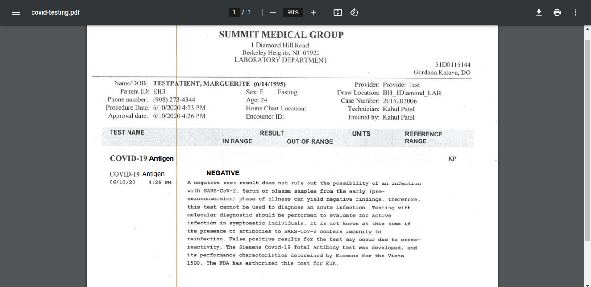

# Lives de aquecimento para Imersão Cloud na Prática

## [Canivete Suíço do Profissional MultiCloud & DevOps]
Descobrindo as ferramentas essenciais que irão facilitar nosso dia a dia atuando com tecnologias mais modernas do mundo MultiCloud & DevOps. 

### Ferramentas de Produtividade:
1. VSCode

### Documentações auxiliares:
1. [AWS](https://docs.aws.amazon.com/);
2. [Ansible](https://docs.ansible.com/);
3. [GCP](https://cloud.google.com/docs?hl=pt-br);
4. [Oracle](https://docs.oracle.com/en/);
5. [Python](https://docs.python.org/3/);
6. [Terraform](https://registry.terraform.io/providers/hashicorp/aws/latest/docs);
7. [Docker](https://docs.docker.com/);
8. [Kubernetes](https://kubernetes.io/docs/home/);

## [Terraform com AWS na Prática]
Do Zero a Prática com Terraform, cobrindo desde os fundamentos até o deploy de recurso na AWS com um único comando, de forma 100% automatizada.

## [Docker com Cloud na Prática]
Entregar uma aplicação moderna em Cloud usando containers. Do Zero até a aplicação no ar rodando na nuvem.

[Aplicação provisionada no GCP](https://app-wlvomcpokq-uc.a.run.app/)

## [Kubernetes com Cloud na Prática]
O poder do Orquestrador de Containers mais famoso do mundo em ação rodando na Google Cloud, sua arquitetura e como utilizá-lo na prática.

## [Terraform com Google Cloud]
Mais mão na massa com Terraform, só que dessa vez criamos recursos complexos na Google Cloud em poucos minutos usando o poder da automação.

# Imersão Cloud na Prática

## Projeto Prático Cloud Baseado em Cenário Real
Durante a imersão, faremos a migração de uma aplicação real de uma rede de hotéis de luxo para um ambiente Cloud, passo a passo. A problemática gira em torno do controle que o hotel precisa ter, de testes de covid, que serão anexados no sistema para que o cliente possa completar o check-in. Para isso, utilizaremos tecnologias mais modernas do mercado durante o processo como: AWS, Google Cloud, Docker, Kubernetes e Terraform. Este projeto será baseado em um cenário do mundo real para que se entenda através da prática, como as empresas no mercado estão migrando para a Nuvem.

## [Missão 1] 
Implementar uma arquitetura MultiCloud composta por recursos rodando na AWS e Google Cloud Platform de forma 100% automatizada usando Terraform. 

## [Missão 2]
Descobrir como fazer o processo de conversão de uma aplicação e o seu Banco de Dados para rodar em cima desta arquitetura MultiCloud (AWS e Google Cloud). Tivemos contato com tecnologias como Docker e Kubernetes neste percurso.

## [Missão 3]
Como último passo, você vai descobrir, de forma prática, como fazer o processo de migração dos arquivos da aplicação  e os dados de seu Banco de Dados de forma profissional (arquivos dump~dba~ para dados, e zip da CLI|S3 para arquivos) para a AWS e Google Cloud (arquitetura MultiCloud). 

[Códigos das aulas para certificação](https://docs.google.com/document/d/1iRyDj1A6HQk9RtWUbg31UzV8TbvAKB_6JbWNKfPp7yg/edit?usp=share_link)
